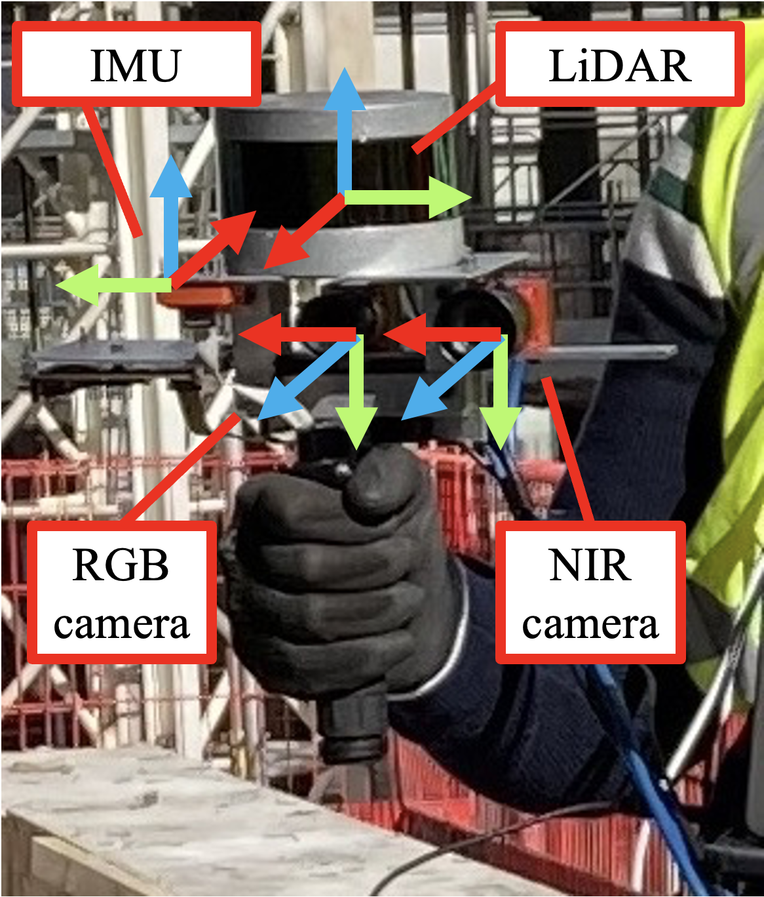
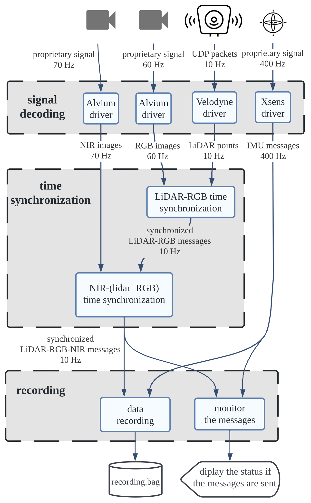

  <h1 align="center">
  ConSLAM: Construction Dataset for SLAM</h1>
  <p align="center">
    <a href="https://mac137.github.io"><strong>Maciej Trzeciak</strong></a>
    ·
    <a href="https://copyme.github.io"><strong>Kacper Pluta</strong></a>
    ·
    <a href="https://yasminfathy.github.io"><strong>Yasmin Fathy</strong></a>
    ·
    <a href=""><strong>Lucio Alcalde</strong></a>
    ·
    <a href=""><strong>Stanley Chee</strong></a>
    ·
    <a href=""><strong>Antony Bromley</strong></a>
    ·
    <a href="https://cit.eng.cam.ac.uk/lab-director"><strong>Ioannis Brilakis</strong></a>
    ·
    <a href="https://team.inria.fr/titane/pierre-alliez/"><strong>Pierre Alliez</strong></a>
  </p>

  <h3 align="center">
    <a href="https://link.springer.com/chapter/10.1007/978-3-031-25082-8_21">ECCV 2022 Workshops Paper</a> |
    <a href="https://www.repository.cam.ac.uk/handle/1810/345700">Free Journal Extension Paper</a>

  </h3>
  <div align="center"></div>
</p>
<p align="center">
  <a href="#">
    
  </a>
</p>

<details open="open" style='padding: 10px; border-radius:5px 30px 30px 5px; border-style: solid; border-width: 1px;'>
  <summary>Table of Contents</summary>
  <ol>
    <li>
      <a href="#download-the-dataset">Download the dataset</a>
    </li>
    <li>
      <a href="#hardware">Hardware</a>
    </li>
    <li>
      <a href="#evaluate-your-trajectory">Evaluate your trajectory</a>
    </li>
    <!-- <li>
      <a href="#install-code">Install code</a>
    </li> -->
    <!-- <li>
      <a href="#faq">FAQ</a>
    </li> -->
    <li>
      <a href="#todo">TODOs</a>
    </li>
    <li>
      <a href="#citation">Citation</a>
    </li>
    <li>
      <a href="#contact">Contact</a>
    </li>
  </ol>
</details>


# Download the dataset

<!-- ```
https://drive.google.com/drive/folders/1qOZGXjlLQNu15xakG7NqE5WEv3Iu9akr?usp=sharing
``` -->
<a href="https://drive.google.com/drive/folders/1qOZGXjlLQNu15xakG7NqE5WEv3Iu9akr?usp=sharing">LINK</a> to the dataset

<span style="color:red">The bag file in sequence 1 is faulty. Do no use it for your SLAM algorithm</span>

# Hardware
<p align="left">
  <a href="#">
    
  </a>
</p>

# Software installation
*Tested on Ubuntu 20.04 with ROS Noetic.*

1. Clone this repo to your catkin work space `path/to/ros_ws/src`
2. Install the dependencies of the packages in this repo using for example `rosdep install --from-paths src --ignore-src -r -y` as instructed [here](http://wiki.ros.org/rosdep)
3. Install the packages in this repo using a standard `catkin_make` command as instructed [here](http://wiki.ros.org/catkin/commands/catkin_make)
  

# How to run
Connect all the sensors: RGB camera, Velodyne and IMU to your computer/laptop.
Make sure the system recongises them all.

Run `roslaunch pp_launcher 4london.launch`

# Evaluate your trajectory
We have extended a popular trajectory evaluation package [evo](https://github.com/MichaelGrupp/evo) for odometry and SLAM trajectory evaluation.

Save your poses you would like to evaluate as individual `.txt` files containing 4x4 pose matrices. Our script in `tools/` can then convert the poses into two file formats that EVO uses. These file formats are TUM and KITTI.

To run the code type: 

```python ./tools/pp2evo.py -w <path_to_dir_ppix_matrices> -t <output_tum_file_format> -k <output_kitti_file_format>```


The tool can output a TUM, a KITTI file, or both if necessary.

## Using EVO
For general information about Evo, please, see the official project web page: https://github.com/MichaelGrupp/evo

## Plotting trajectories by EVO

To plot trajectories against a reference, it is sufficient to call:

```evo_traj tum 00_ORB.txt 00_SPTAM.txt --ref=00_gt.txt -p --plot_mode=xy```

in the above example, TUM file format is used (see the first argument). The KITTI file format is quite limited, and it should not be used.

To compute Absolute Pose Error we can simply call

```evo_ape tum 00_gt.txt 00_ORB.txt -v --plot --plot_mode xy --save_results results/ORB.zip```

In this example, the automatic alignment of trajectories is switched off.

Note that the zip file can be used for further plotting in using `evo_res`, e.g.,

```evo_res results/*.zip -p --save_table results/table.csv```


## Generating high-quality plots

To generate plots ready for a paper, set up the configuration of Evo as you desire with `evo config`, for example:

``` sh
evo_config set plot_seaborn_style whitegrid \
               plot_fontfamily serif plot_fontscale 1.2 \
               plot_linewidth 1.0 \
               plot_figsize 5 4.5 \
               ros_map_unknown_cell_value 128 \
               plot_usetex               
 ```

Before and after:

  <a href="https://github.com/MichaelGrupp/evo/wiki/images/plot_style_default.png" target="_blank">
    
  </a>
  
  <a href="https://github.com/MichaelGrupp/evo/wiki/images/plot_style_changed.png" target="_blank">
    
  </a>

You can find more information about this configuration [here](https://github.com/MichaelGrupp/evo/wiki/Plotting).

<!-- # Install code
Install the code used for data collection on construction site.
<p align="left">
  <a href="#">
    
  </a>
</p>

coming soon


# FAQ
coming soon -->


# TODO
- [ ] Replace evo images with ConSLAM trajectories.
- [ ] create a docker image for faster installation


# Citation
Please cite either of the papers:
```bibtex
@inproceedings{trzeciak2023conslam,
  title={Conslam: Periodically collected real-world construction dataset for SLAM and progress monitoring},
  author={Trzeciak, Maciej and Pluta, Kacper and Fathy, Yasmin and Alcalde, Lucio and Chee, Stanley and Bromley, Antony and Brilakis, Ioannis and Alliez, Pierre},
  booktitle={Computer Vision--ECCV 2022 Workshops: Tel Aviv, Israel, October 23--27, 2022, Proceedings, Part VII},
  pages={317--331},
  year={2023},
  organization={Springer}
}
```
```bibtex
@article{trzeciak2023conslamExtension,
  title={ConSLAM: Construction Data Set for SLAM},
  author={Trzeciak, Maciej and Pluta, Kacper and Fathy, Yasmin and Alcalde, Lucio and Chee, Stanley and Bromley, Antony and Brilakis, Ioannis and Alliez, Pierre},
  journal={Journal of Computing in Civil Engineering},
  volume={37},
  number={3},
  pages={04023009},
  year={2023},
  publisher={American Society of Civil Engineers}
}
```


# Contact
I have ideas on how to improve this dataset, but I am just about to graduate so I might not have much time to work on this these months. If you are interested in cooperation, feel free to reach out: <a href="https://mac137.github.io"><strong>mac137.github.io</strong></a>


# License
Copyright (C) 2023, University of Cambridge, all rights reserved.
 
THIS SOFTWARE IS PROVIDED “AS IS” FOR ACADEMIC USE ONLY AND ANY EXPRESS OR IMPLIED WARRANTIES, INCLUDING, BUT NOT LIMITED TO, THE IMPLIED WARRANTIES OF MERCHANTABILITY
AND FITNESS FOR A PARTICULAR PURPOSE ARE DISCLAIMED. IN NO EVENT SHALL THE COPYRIGHT HOLDERS OR CONTRIBUTORS BE LIABLE FOR ANY DIRECT, INDIRECT, INCIDENTAL, SPECIAL, EXEMPLARY. OR CONSEQUENTIAL DAMAGES (INCLUDING, BUT NOT LIMITED TO, PROCUREMENT OF SUBSTITUTE GOODS OR SERVICES; LOSS OF USE, DATA, OR PROFITS; OR BUSINESS INTERRUPTION)
HOWEVER CAUSED AND ON ANY THEORY OF LIABILITY, WHETHER IN CONTRACT, STRICT LIABILITY, OR TORT (INCLUDING NEGLIGENCE OR OTHERWISE) ARISING IN ANY WAY OUT OF THE USE OF THIS SOFTWARE, EVEN IF ADVISED OF THE POSSIBILITY OF SUCH DAMAGE.